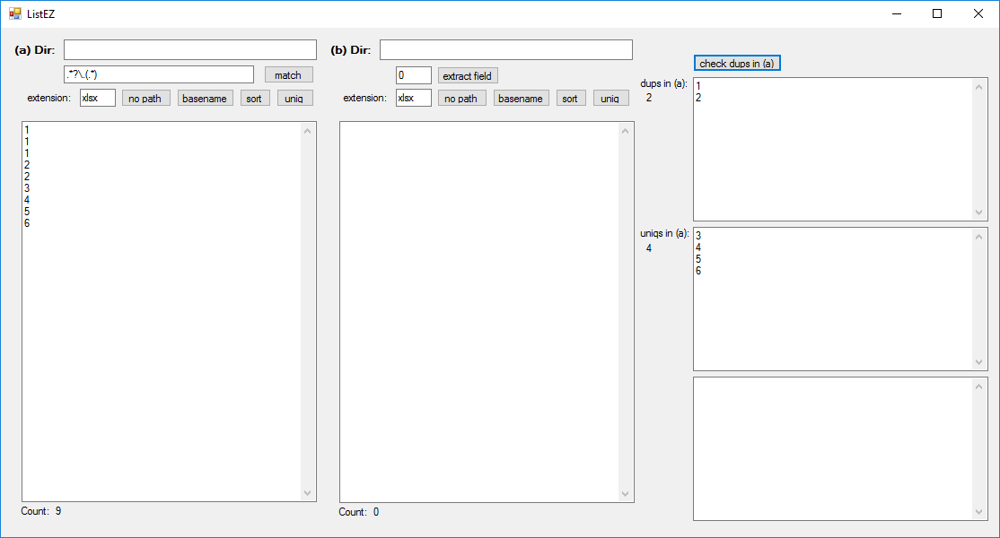
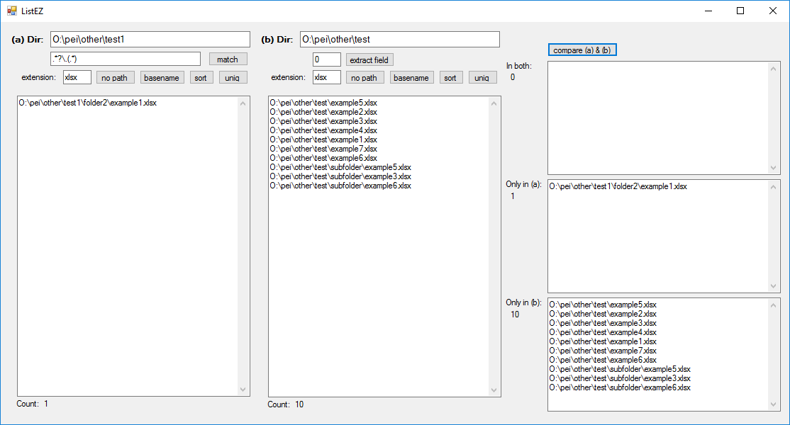

# Introduction

* Need to compare two lists? 

* Need to find duplicated and unique items in one list? 

* Need to compare files of certain type in two directories? 

* Need to extract fields from a list? 

ListEZ is a tool for doing these kind of jobs. 

# Usage

## Java version:
Run: ./Java/ListEZ.jar
E.g., on Mac: 
java -XstartOnFirstThread -jar ListEZ.jar

Note: 
* need Java version 1.8. 
* If you run on Windows, need to include the correct version of SWT.jar for your system. 

## C# version:
In Windows system, double click: ./C#/bin/Debug/ListEZ.exe

## Screenshots:

## Check duplicated items in one list

If list (b) is empty, then clicking on "check dups in (a)", will show the duplicated and unique items in list (a). 

## Compare two directories or two lists

If list (b) is not empty, "check dups in (a)" becomes "compare (a) & (b)" for comparing two lists. The two lists can be files in two directories. 

To compare files in two directories, first, load the file lists. A list of files can be loaded by specifying the directory path (will look for files recursively), or pasting directly to the list box. 

The functionalities of the buttons are:

* extension: specify the extension to show files with that extension only. If the extension field is empty, all files will be shown. 
* no path: strip the path and keep file name only.
* basename: strip the path and remove extension. 
* sort: sort the current contents in the list box.
* unique: remove duplicated items (keep only one) from the current contents in each of the file region.

* match: enter regex pattern in the form, then clicking on match will match and replace the items from the current contents in file region 1 with the first group, and show the result in file region 2. Items that don't match with the pattern will be removed. For example, if the items in file region 1 are:

prefix_111.type   
prefix_222.type   
prefix_333.type

Then click on "match" with the pattern ".*_(.*).type", the following will be shown in file region 2:
111
222
333

This function is useful when you want to extract some information with fixed pattern from each item in the list. 

* extract field: if the lines in list (b) has tabs, you can use this to extract a particular field. 

* check dups in (a): check duplicated and unique items in list (a).
* compare (a) & (b): compare the two lists. 

## Compare two lists

You can directly type or paste two (or one) lists into the two list boxes for comparison. If you paste a list with only one line and it's separated by tabs, it will be splitted into mulitple lines. This feature is useful when you want to compare two rows. 

